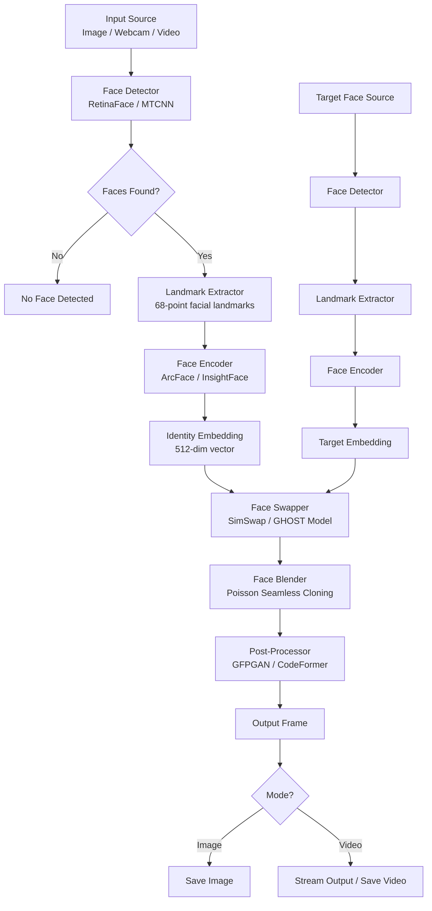

# Face Swap App

An AI-powered real-time face swapping application that uses deep learning to detect, extract, and seamlessly swap faces between images and video streams.

## Architecture



## Features

- Real-time face swapping via webcam
- Batch processing for images and video files
- Multiple face detection support
- Face enhancement post-processing (GFPGAN/CodeFormer)
- GPU-accelerated inference with CUDA
- REST API for integration

## Tech Stack

| Layer | Technology |
|-------|-----------|
| Language | Python 3.10+ |
| Face Detection | RetinaFace, MTCNN |
| Face Recognition | InsightFace / ArcFace |
| Swap Model | SimSwap, GHOST |
| Face Enhancement | GFPGAN, CodeFormer |
| CV Backend | OpenCV 4.x |
| API Server | FastAPI + Uvicorn |
| GPU Acceleration | CUDA 11.8+ / PyTorch |

## How to Run

```bash
# 1. Clone and install dependencies
git clone https://github.com/jadfarhat-cell/face-swap-app.git
cd face-swap-app
pip install -r requirements.txt

# 2. Download pretrained models
python scripts/download_models.py

# 3. Run webcam demo
python app.py --mode webcam --source your_face.jpg

# 4. Run on image
python app.py --mode image --source face.jpg --target photo.jpg --output result.jpg

# 5. Launch API server
uvicorn api:app --host 0.0.0.0 --port 8000
```

### Docker
```bash
docker build -t face-swap-app .
docker run --gpus all -p 8000:8000 face-swap-app
```

## Project Structure

```
face-swap-app/
├── app.py # Main application entry point
├── api.py # FastAPI REST API
├── models/ # Pretrained model weights
├── modules/
│ ├── detector.py # Face detection
│ ├── encoder.py # Face encoding
│ ├── swapper.py # Core swap logic
│ └── enhancer.py # Post-processing
├── scripts/
│ └── download_models.py
├── requirements.txt
└── Dockerfile
```

## Disclaimer

This tool is intended for creative and educational purposes only. Please use responsibly and ethically. Do not create deepfakes of real people without consent.